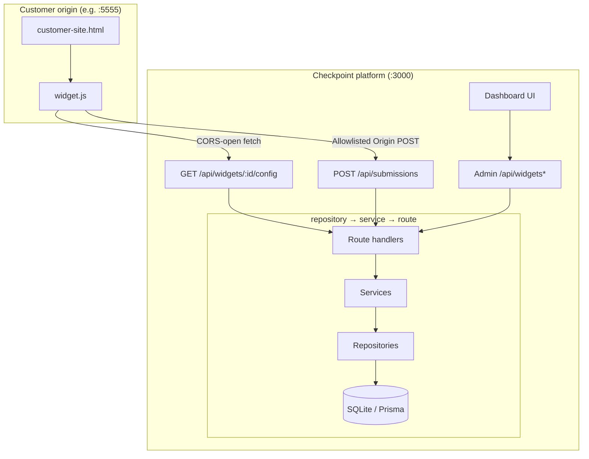
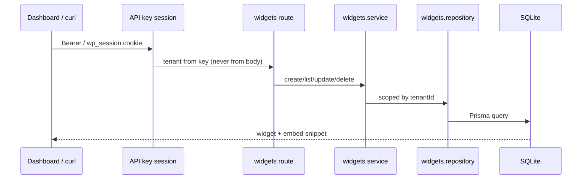
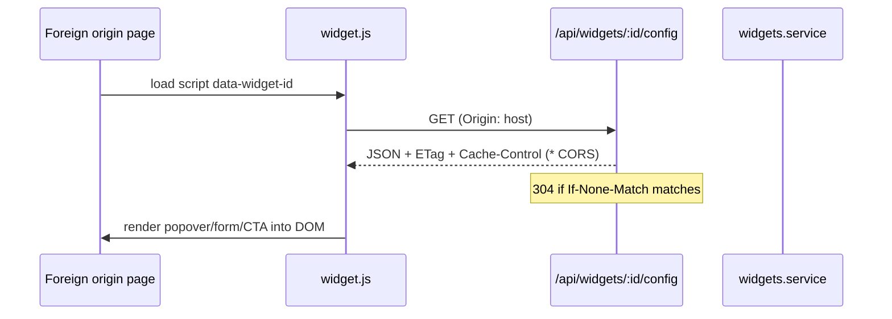
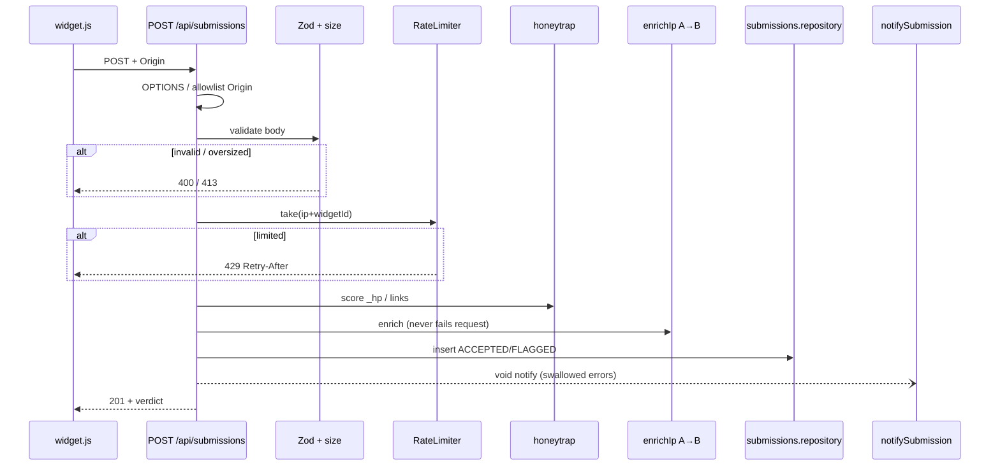

# Diagrams

## Component layout

```mermaid
flowchart TB
  subgraph CustomerOrigin["Customer origin (e.g. :5555)"]
    HTML["customer-site.html"]
    WJ["widget.js"]
    HTML --> WJ
  end

  subgraph Platform["Checkpoint platform (:3000)"]
    CFG["GET /api/widgets/:id/config"]
    SUB["POST /api/submissions"]
    ADM["Admin /api/widgets*"]
    DASH["Dashboard UI"]

    subgraph Layers["repository → service → route"]
      RH[Route handlers]
      SVC[Services]
      REPO[Repositories]
      DB[(SQLite / Prisma)]
      RH --> SVC --> REPO --> DB
    end

    CFG --> RH
    SUB --> RH
    ADM --> RH
    DASH --> ADM
  end

  WJ -->|CORS-open fetch| CFG
  WJ -->|Allowlisted Origin POST| SUB
```

## Admin CRUD flow

```mermaid
sequenceDiagram
  participant Admin as Dashboard / curl
  participant Auth as API key session
  participant WH as widgets route
  participant S as widgets.service
  participant R as widgets.repository
  participant DB as SQLite

  Admin->>Auth: Bearer / wp_session cookie
  Auth->>WH: tenant from key (never from body)
  WH->>S: create/list/update/delete
  S->>R: scoped by tenantId
  R->>DB: Prisma query
  DB-->>Admin: widget + embed snippet
```

## Embed / config fetch

```mermaid
sequenceDiagram
  participant Host as Foreign origin page
  participant JS as widget.js
  participant CFG as /api/widgets/:id/config
  participant S as widgets.service

  Host->>JS: load script data-widget-id
  JS->>CFG: GET (Origin: host)
  CFG-->>JS: JSON + ETag + Cache-Control (* CORS)
  Note over CFG: 304 if If-None-Match matches
  JS->>Host: render popover/form/CTA into DOM
```

## Submission pipeline

```mermaid
sequenceDiagram
  participant JS as widget.js
  participant API as POST /api/submissions
  participant Val as Zod + size
  participant RL as RateLimiter
  participant Spam as honeytrap
  participant Geo as enrichIp A→B
  participant DB as submissions.repository
  participant Mail as notifySubmission

  JS->>API: POST + Origin
  API->>API: OPTIONS / allowlist Origin
  API->>Val: validate body
  alt invalid / oversized
    Val-->>JS: 400 / 413
  end
  API->>RL: take(ip+widgetId)
  alt limited
    RL-->>JS: 429 Retry-After
  end
  API->>Spam: score _hp / links
  API->>Geo: enrich (never fails request)
  API->>DB: insert ACCEPTED/FLAGGED
  API--)Mail: void notify (swallowed errors)
  API-->>JS: 201 + verdict
```
